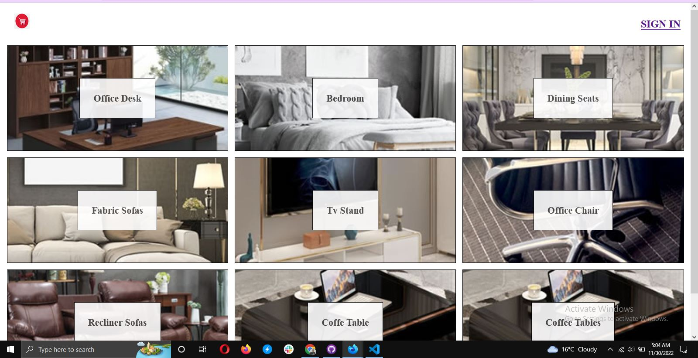
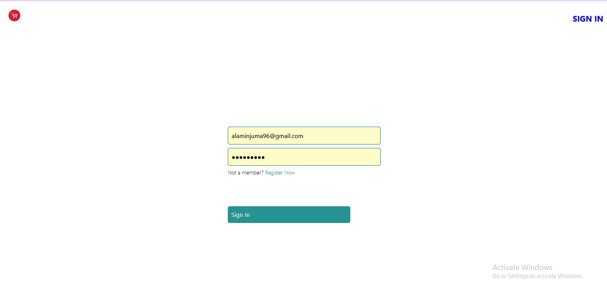
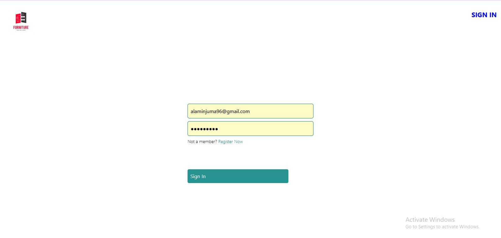
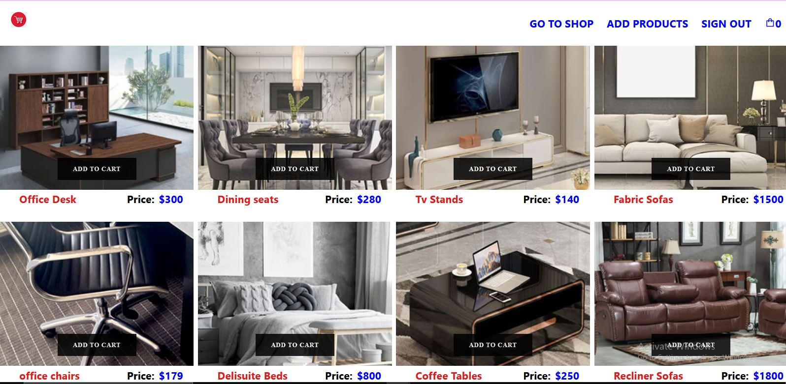
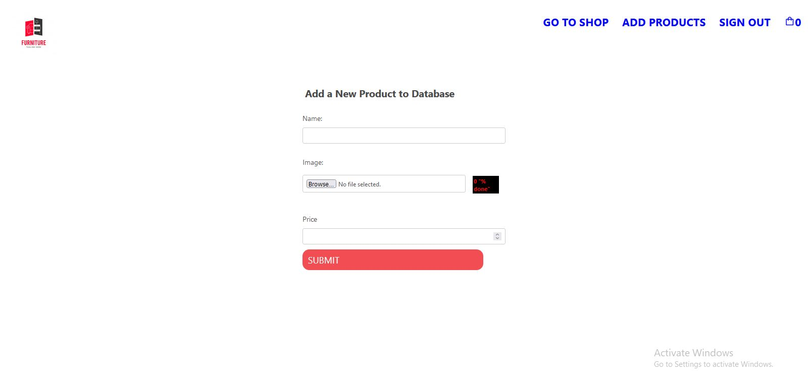
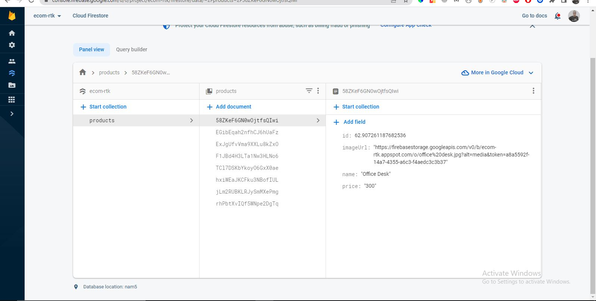

# React-Redux-Toolkit
an e-commerce-app utilizing Redux-toolkit, RTK query  and firebase for Auth and Cart features using firestore

## Home page displaying furnitures from firestore and sign in 

## sign-in/sign-up

## change navbar with Logout and view prodcuts/cart/add products to firestore

## add products page 

## add data to firestore database

## Display payload shop data  from firestore

