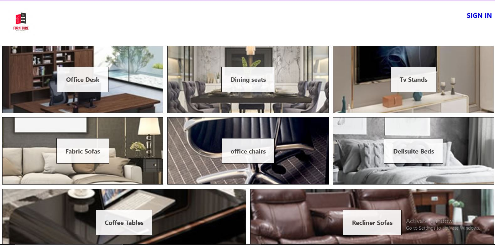

# React-Redux-Toolkit
an e-commerce-app utilizing Redux toolkit, RTK query, and firebase for Auth and Cart features using firestore

## Home page displaying furniture from firestore and sign in 

## sign-in/sign-up

## change navbar with Logout and view products/cart/add products to firestore

## add products page 

## add data to firestore database

## Display payload shop data  from firestore

## Add items to cart state 

