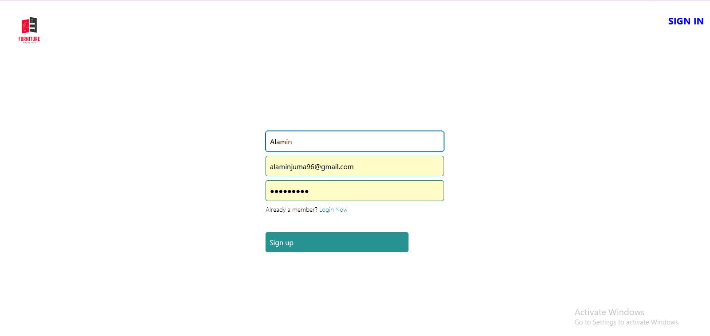

# React-Redux-Toolkit
an e-commerce-app utilizing Redux toolkit, RTK query, and firebase for Auth and Cart features using firestore

## Home page displaying furniture from firestore and sign in 

## sign-up if no account. 

## route to sign-in after sign-up

## change navbar with Logout and view products/cart/add products to firestore

## add data to firestore database

## fetch and  Display payload shop data  from firestore after adding product data 

## togglecart icon to true/false to display cart modol. If no items, show no cart items and route to add cart items 

## Add items to cart state. can clear all cart items. can decrease or increase cart quantity items. display tottal price of all cart items 

